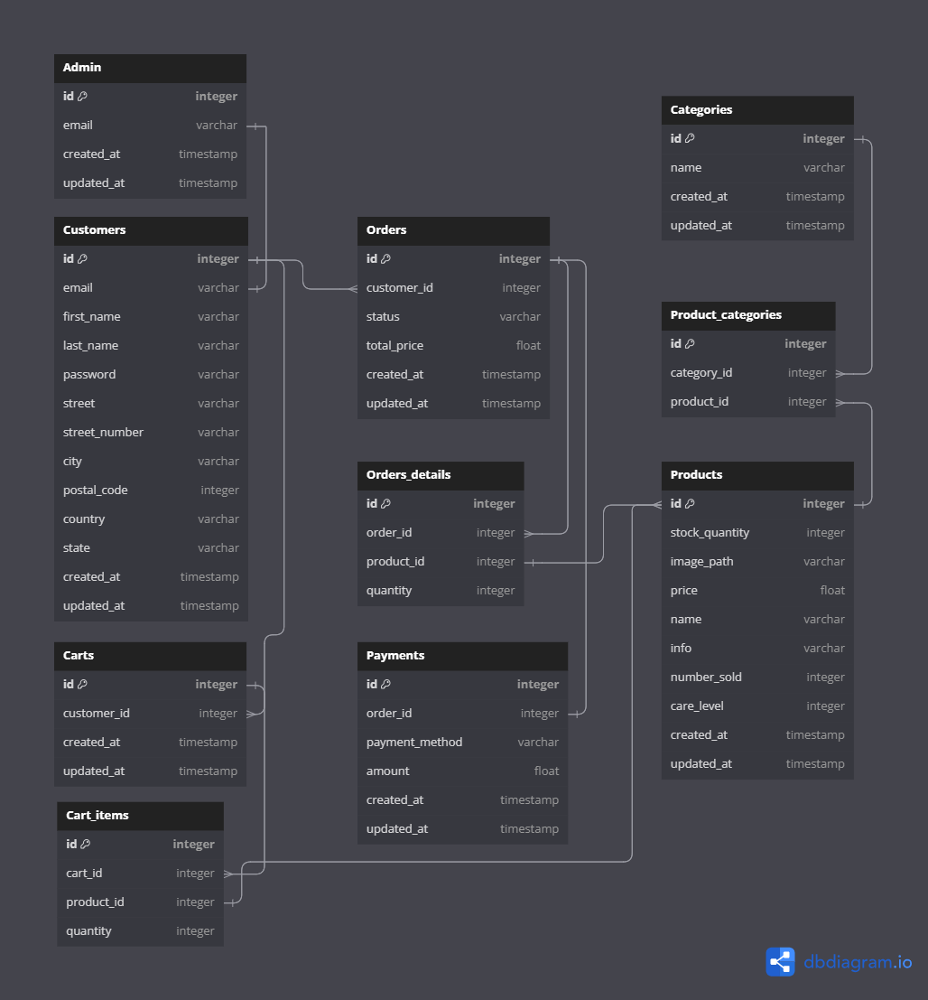

# Semestrálny projekt - elektronický obchod

### Vypracové Viktóriou Bukovskou a Jakubom Hrdlovičom

### Github repo: https://github.com/meowiky/WTECH-2024-Bukovska-Hrdlovic

## Zadanie:

Vytvorte webovú aplikáciu - eshop, ktorá komplexne rieši nižšie definované prípady použitia vo vami zvolenej doméne (napr. elektro, oblečenie, obuv, nábytok).

### Aplikácia - eshop

**Aplikácia musí realizovať tieto prípady použitia:**

**Klientská časť**
* zobrazenie prehľadu všetkých produktov z vybratej kategórie používateľom
    * základné filtrovanie (aspoň podľa 3 atribútov, napr. rozsah cena od-do, značka, farba)
    * stránkovanie
    * preusporiadanie produktov (napr. podľa ceny vzostupne/zostupne)
* zobrazenie konkrétneho produktu - detail produktu
    * pridanie produktu do košíka (ľubovolné množstvo)
* plnotextové vyhľadávanie nad katalógom produktov
* zobrazenie nákupného košíka
    * zmena množstva pre daný produkt
    * odobratie produktu
    * výber dopravy
    * výber platby
    * zadanie dodacích údajov
    * dokončenie objednávky
    * umožnenie nákupu bez prihlásenia
    * prenositeľnosť nákupného košíka v prípade prihláseného používateľa
* registrácia používateľa/zákazníka
* prihlásenie používateľa/zákazníka
* odhlásenie zákazníka

**Administrátorská časť**
* prihlásenie administrátora do administrátorského rozhrania eshopu
* odhlásenie administrátora z administrátorského rozhrania
* vytvorenie nového produktu administrátorom cez administrátorské rozhranie
    * produkt musí obsahovať minimálne názov, opis, aspoň 2 fotografie
* upravenie/vymazanie existujúceho produktu administrátorom cez administrátorské rozhranie

## Diagram fyzického dátového modelu

**Zmeny oproti prvej prvej fázy**
* Odstránenie hodnoty status z tabulky Carts. Pri implementácií sme nenašli sme žiadne využitie.
* Odstránenie hodnoty category_id z tabulky Products. Nepotrebné, Products a Categories sú prepojené pomocou tabulky Product_categories.
* Pridanie timestampov created_at a updated_at do väčšiny tabuliek.

## Programovacie prostredie
Pre prácu bolo použité programovacie prostredie VisualStudio Code.

## Aplikácia

Pred prvým spustením aplikácie treba následovať návod v [README.md](PlantiesAPI%2FREADME.md)

Po zbehnutí `php artisan migrate:fresh --seed` sa automaticky do databázy pridá 12 testovacích produktov aj s kategóriami  
Seeder sa nachádza tu [DatabaseSeeder.php](PlantiesAPI%2Fdatabase%2Fseeders%2FDatabaseSeeder.php)

Authentifikáciu, prihlasovanie a registrácia je pomocou breeze, ktoré sme si upravili podľa našich požiadaviek

## Základný layout stránok a navigácia

[app.blade.php](PlantiesAPI%2Fresources%2Fviews%2Flayouts%2Fapp.blade.php)  
[footer.blade.php](PlantiesAPI%2Fresources%2Fviews%2Flayouts%2Ffooter.blade.php)  
[header.blade.php](PlantiesAPI%2Fresources%2Fviews%2Flayouts%2Fheader.blade.php)  

Každá stránka používa tento layout.
Navigácia obsahuje:

- **Log out:** Toto je odkaz pre odhlásenie, ktorý je aktívny, ak je užívateľ prihlásený. Tento odkaz spustí odoslanie formulára na odhlásenie (`POST` požiadavka).
- **Admin Dashboard:** Ak je prihlásený užívateľ administrátorom, zobrazí sa odkaz na administračný panel.
- **Sign up / Sign In:** Ak užívateľ nie je prihlásený, zobrazí sa odkaz na stránku pre registráciu kde sa dá prekliknúť na prihlásenie
- **Profile icon** Ak je používateľ prihlásený zobrazí sa stránka profilu, ak nie je, zobrazí sa login page

- **Logo:** Kliknutím na logo sa užívateľ dostane na úvodnú stránku.
- **Domovská stránka:** Odkaz na domovskú stránku.
- **Produkty:** Odkaz na stránku s produktami.

- Pri kliknutí na ikonu košíka sa zobrazí rozbaľovacie menu s aktuálnym obsahom nákupného košíka.
- **Obsah košíka:** Zobrazuje sa miniaturka produktu, množstvo zakúpeného produktu a jeho cena. ([CartController.php](PlantiesAPI%2Fapp%2FHttp%2FControllers%2FCartController.php) )
- **Celková cena:** V spodnej časti rozbaľovacieho menu sa zobrazuje celková cena položiek v košíku.
- **Checkout:** Tlačidlo, ktoré užívateľa prevedie na stránku pre vykonanie nákupu (checkout).

## Home page

[home.blade.php](PlantiesAPI%2Fresources%2Fviews%2Fhome.blade.php)  
[HomeController.php](PlantiesAPI%2Fapp%2FHttp%2FControllers%2FHomeController.php)

Domovská stránka obsahuje nedávno pridané produkty

## Register page

[register.blade.php](PlantiesAPI%2Fresources%2Fviews%2Fauth%2Fregister.blade.php)  
[Auth](PlantiesAPI%2Fapp%2FHttp%2FControllers%2FAuth)

### Formulár na Registráciu
- **Formulár**:
  - **Email**: Pole s placeholderom "Email"
  - **Heslo**: Pole s placeholderom "Password"
  - **Potvrdenie Hesla**: Druhé pole na heslo s placeholderom "Confirm Password", kde používatelia potvrdia zadané heslo.
- Každé pole na vstup dát má v prípade chyby pri zadávaní pripravené zobrazenie chybovej správy, ktorá informuje používateľa o probléme

- **Link na Prihlásenie**: Pre používateľov, ktorí už účet majú, je na formulári link "Login" (Prihlásiť sa), ktorý ich presmeruje na prihlasovaciu stránku.

## Login page

[login.blade.php](PlantiesAPI%2Fresources%2Fviews%2Fauth%2Flogin.blade.php)  
[Auth](PlantiesAPI%2Fapp%2FHttp%2FControllers%2FAuth)

### Formulár na Prihlásenie
- **Formulár**:
  - **Email**: Pole s placeholderom "Email"
  - **Heslo**: Pole s placeholderom "Password"
- Každé pole na vstup dát má v prípade chyby pri zadávaní pripravené zobrazenie chybovej správy, ktorá informuje používateľa o probléme (napr. neplatný formát emailu, nesprávne heslo atď.).

Remember me a Forgot your password? niesú implementované
- odkaz na registráciu

## Products page

[products.blade.php](PlantiesAPI%2Fresources%2Fviews%2Fproducts.blade.php)  
[product_tiles.blade.php](PlantiesAPI%2Fresources%2Fviews%2Fpartials%2Fproduct_tiles.blade.php)  
[ProductsController.php](PlantiesAPI%2Fapp%2FHttp%2FControllers%2FProductsController.php)

### Základné komponenty
* Filtrovanie podľa kategórií a úrovne starostlivosti: 
  * Umožňuje používateľom vybrať produkty podľa kategórie alebo úrovne starostlivosti. Filtre sú reprezentované checkboxespre kategórie a radio buttonspre úrovne starostlivosti.
* Hľadacie pole: 
  * Umožňuje používateľom hľadať produkty podľa názvu. Výsledky sa aktualizujú v reálnom čase pri zadávaní hľadaného výrazu.
* Triedenie: 
  * Používatelia môžu produkty triediť podľa dátumu pridania, ceny a iných kritérií cez dropdown.
* Paginácia: 
  * Umožňuje prechádzať medzi stránkami výsledkov.
* Výpis produktov: 
  * Zobrazenie produktov je dynamicky aktualizované na základe filtrovania, hľadania a triedenia. Každý produkt má miniaturu, názov, cenu a tlačidlo na pridanie do košíka.

* **Backend logika**
* Filtrácia: 
  * Produkty sú filtrované na základe kritérií zadaných používateľom, ako sú kategória, úroveň starostlivosti a hľadaný výraz.
* Triedenie: 
  * Produkty môžu byť zoradené podľa rôznych kritérií, čo zabezpečuje kontrolu nad tým, ako sú produkty zobrazené.
* Paginácia: 
  * Zabezpečuje rozdelenie výsledkov na viaceré stránky.

* **Interakcia na klientskej strane (JavaScript)**
  * Aktualizácia URL a histórie prehliadača: 
    * Pri každej zmene filtrov alebo triedenia alebo aktuálnej stránky sa URL adresa dynamicky aktualizuje.
  * Asynchrónne načítavanie: 
    * Obsah stránky (výpis produktov) je načítavaný asynchrónne bez potreby obnovovania celej stránky.
  

* **Funkcie skriptu**
  * updateSortDropdown(): 
    * Aktualizuje vybranú hodnotu v rozbaľovacom zozname triedenia podľa parametrov URL.
  * updateSearchField(): 
    * Obnovuje hľadaný výraz v hľadacom poli pri obnovení stránky alebo pri načítaní s už existujúcimi parametrami URL.
  * bindEventListeners(): 
    * Priraďuje udalosti na elementy stránky, aby reagovali na používateľské interakcie ako zmena filtrov alebo zadávanie textu do hľadacieho poľa.
  * getActiveFilters(): 
    * Zbiera aktívne filtre a triedenie do objektu URLSearchParams, ktorý sa používa na aktualizáciu obsahu prostredníctvom asynchrónnych požiadaviek.

## Admin dashboard

[dashboard.blade.php](PlantiesAPI%2Fresources%2Fviews%2Fadmin%2Fdashboard.blade.php)  
[ProductController.php](PlantiesAPI%2Fapp%2FHttp%2FControllers%2FAdmin%2FProductController.php)

Stránka "Admin Dashboard" slúži na správu produktov v online obchode. Umožňuje administrátorom pridávať, aktualizovať a odstraňovať produkty, ako aj spravovať kategórie, do ktorých sú produkty zaradené.

### Hlavné komponenty stránky:
1. **Pridanie Nového Produktu**
  - Formulár umožňuje vložiť názov produktu, cenu, úroveň starostlivosti, množstvo na sklade, popis a obrázok produktu.
  - Po vyplnení formulára a stlačení tlačidla "Add Product" sa produkt uloží do databázy.

2. **Tabuľka Produktov**
  - Zobrazuje zoznam všetkých produktov s ich základnými informáciami ako obrázok, názov, cena, úroveň starostlivosti, množstvo na sklade a popis.
  - Každý produkt v tabuľke má možnosť byť upravený alebo odstránený, a tiež je možné pridávať alebo odoberať kategórie, do ktorých je produkt zaradený.

3. **Úprava a Odstránenie Produktu**
  - Vedľa každého produktu sú tlačidlá pre úpravu a odstránenie. Tlačidlo pre úpravu otvorí formulár, kde je možné zmeniť informácie o produkte. Tlačidlo pre odstránenie vymaže produkt z databázy.
  - Pri odstraňovaní produktu sa tiež kontroluje a zmaže obrázok produktu zo servera, ak existuje.

4. **Pridanie a Odobratie Kategórií**
  - Pre každý produkt je možné pridávať alebo odstraňovať kategórie priamo v tabuľke produktov.
  - Pridanie kategórie sa realizuje cez malý formulár s textovým poľom a tlačidlom "Add".

5. **Validácia Formulárov**
  - Všetky formuláre na tejto stránke používajú validáciu na serverovej strane, aby sa zabezpečilo, že všetky vstupy sú správne a úplné predtým, než sú uložené do databázy.

## Product Detail Page

[product_detail.blade.php](PlantiesAPI%2Fresources%2Fviews%2Fproduct_detail.blade.php)  
[ProductDetailController.php](PlantiesAPI%2Fapp%2FHttp%2FControllers%2FProductDetailController.php)

### Detail Produktu
- **Názov produktu** 
- **Cena produktu**
- **Popis produktu**
- **Obrázok produktu**
- **Formulár na pridanie do košíka** umožňuje užívateľom vybrať množstvo produktu, ktoré chcú kúpiť, a pridať ho do košíka. Formulár obsahuje skryté pole s ID produktu, pole pre množstvo s predvolenou hodnotou 1 a tlačidlo na pridanie produktu do košíka.

## Profile page

[profile.blade.php](PlantiesAPI%2Fresources%2Fviews%2Fprofile.blade.php)  
[ProfileController.php](PlantiesAPI%2Fapp%2FHttp%2FControllers%2FProfileController.php)

Na túto stránku sa dostane len prihlásený používateľ, ak pouýívateľ nie je prihlásený presmeruje ho to na prihlasovaciu stránku

Stránka obsahuje dve hlavné sekcie:

### Fakturačná adresa

- **Hlavný formulár** umožňuje užívateľovi aktualizovať svoju fakturačnú adresu a osobné informácie.
- Polia formulára zahŕňajú meno, priezvisko, adresu, mesto, štát, poštové smerovacie číslo a krajinu.
- Všetky polia sú vyžadované a obsahujú validácie, ktoré pri chybe zobrazujú upozornenie.
- Formulár obsahuje tlačidlo na uloženie zmien, ktoré odosiela dáta na server na spracovanie.

### Zmena hesla

- **Formulár pre zmenu hesla** 
- Užívateľ musí zadať súčasné heslo, nové heslo a potvrdiť nové heslo.
- Aj tu sú prítomné validácie a pri neúspešnej validácii sa zobrazujú chybové hlášky.

## Cart Page

[cart_page.blade.php](PlantiesAPI%2Fresources%2Fviews%2Fcart_page.blade.php)  
[CartPageController.php](PlantiesAPI%2Fapp%2FHttp%2FControllers%2FCartPageController.php) 

### Tabuľka s obsahom košíka:

- Názov produktu
- Cena a celková cena produktu
- Množstvo daného tovaru v košíku a možnost zmeniť množstvo tovaru v košíku
- Možnosť odstrániť produkt z košíka

## Checkout Page
 
[checkout.blade.php](PlantiesAPI%2Fresources%2Fviews%2Fcheckout.blade.php)  
[CheckoutController.php](PlantiesAPI%2Fapp%2FHttp%2FControllers%2FCheckoutController.php)  

### Formulár informácií na vytvorenie objednávky

- Polia formulára zahŕňajú meno, priezvisko, adresu, mesto, štát, poštové smerovacie číslo a krajinu.
- Všetky polia sú vyžadované a obsahujú validácie, ktoré pri chybe zobrazujú upozornenie.
- Polia sú vypísané pre prihlásených uživateľov podľa toho ako si nastavie informácie v profile.
- Možnosť výberu spôsobu platby
- Malá tabulka s obsahom košíka